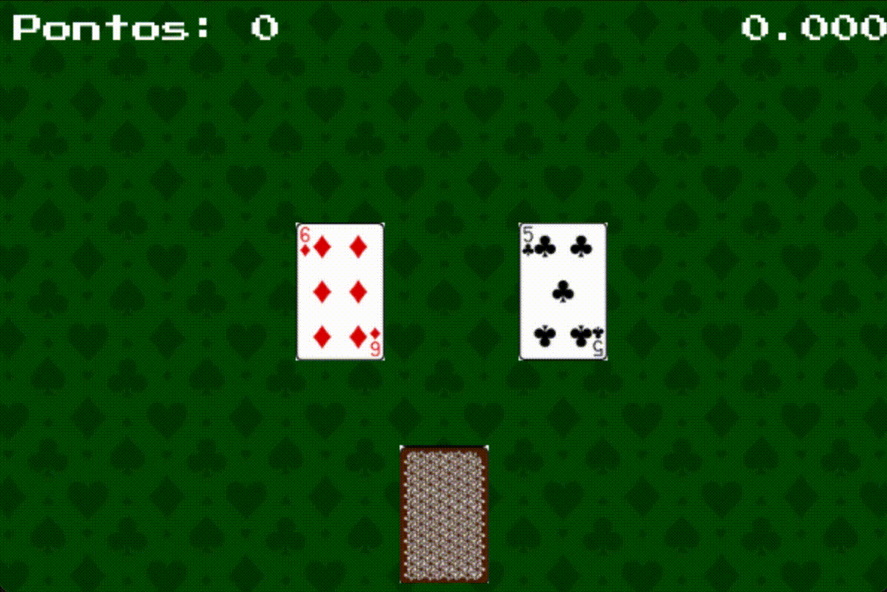
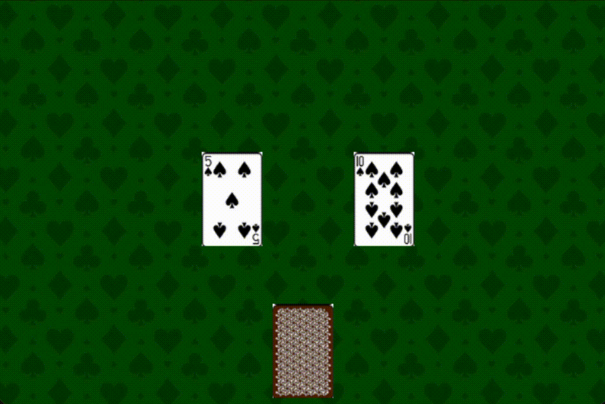
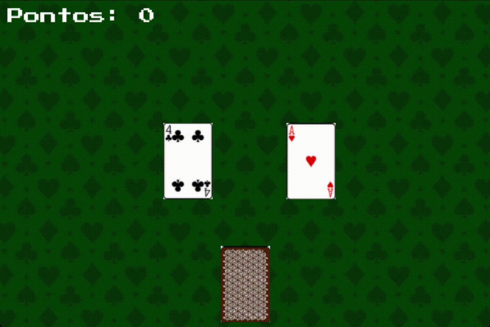

# Avaliação para Ninja

Sua tarefa será implementar uma versão simplificada do jogo "Speed Memory" utilizando a biblioteca Pygame. O jogo consiste em verificar se cartas tem algo em comum ou não o mais rápido possível. Abaixo apresentamos o resultado esperado para o nível avançado:

<div align="center">
    
</div>

## IMPORTANTE! Entrega da avaliação

Para enviar a solução desta avaliação, basta realizar commits no repositório. A quantidade de funcionalidades será utilizada na avaliação.

## NÍVEL BÁSICO

O código principal do seu jogo deve ser escrito no arquivo `jogo.py`.

1. Criando o jogo:
    - Crie uma janela com dimensões 600 x 400;
    - Adicione um título a janela com o nome "Desafio Pygame";
    - Ao clicar em sair, o jogo finaliza sem erros.

2. Desenhando o fundo e o baralho:
    - Carregue a imagem `'assets/images/fundo.jpg'`
    - Desenhe o fundo na posição `(0, 0)` (todas as imagens já estão no tamanho correto)
    - Carregue a imagem `'assets/images/baralho.png'`
    - Desenhe o baralho na posição `(270, 300)` (todas as imagens já estão no tamanho correto)

3. Criando as cartas:

    Devem ser exibidas duas cartas, uma ao lado da outra. Para isso:

    - Importe a função `sorteia_carta` do arquivo `funcoes_auxiliares.py`;
    - Utilize a função `sorteia_carta` para sortear duas cartas;
    - Armazene cada uma das cartas no dicionário de `estado`;
    - A função `sorteia_carta` não recebe argumentos e retorna um dicionário com as chaves `'imagem'` , `'numero'` e `'naipe'`. Por exemplo:
        ```python
        {
            'imagem': pygame.image.load('assets/images/2_de_ouros.png'),
            'numero': 2,
            'naipe': 'Ouros'
        }
        ```
        Perceba que a imagem já foi carregada. Você só precisa desenhar a imagem na tela.

4. Desenhe as cartas na tela:
    - Desenhe a imagem da carta na esquerda na posição `(200, 150)`;
    - Desenhe a imagem da carta na direita na posição `(350, 150)`.

5. Desenhe novas cartas:
    - Quando o jogador clicar com o mouse, a carta da esquerda deve ser substituída por uma nova carta;
    - Quando o jogador clicar com o mouse uma segunda vez, a carta da direita deve ser substituída por uma nova carta;
    - Esse processo deve se repetir indefinidamente, alternando a carta trocada a cada clique.

Ao final desta etapa, o jogo deve estar assim:

<div align="center">
    
</div>

___

## NÍVEL PROFICIENTE

1. Atinja o nível anterior.
2. O código do jogo é estruturado em funções ou classes.
    - Caso utilize funções, deve utilizar pelo menos a funções listadas a seguir: `inicializa`, `desenha`, `atualiza_estado` e `game_loop`
3. Marque a pontuação:
    - Quando o jogador pressionar a tecla `espaço`, faça os itens a seguir:
        - Caso as duas cartas tenham o mesmo número ou naipe, o jogador recebe 1 ponto.
        - Caso as cartas não tenham nada em comum, o jogador perde um ponto.
        - Ao fim, atualize a carta da vez.
    - Caso as cartas tenham algo em comum e o jogador clique com o mouse, o jogador perde um ponto.
    - O jogador começa com 0 pontos.
4. Desenhe a pontuação:
    - Utilize a fonte `'assets/font/PressStart2P.ttf'` para desenhar a pontuação no canto superior esquerdo.
5. Implemente o fim de jogo:
    - O jogo deve fechar quando o jogador ficar com menos de 0 pontos. Seu jogo não pode terminar com um erro.


<div align="center">
    
</div>

___

## NÍVEL AVANÇADO
1. Atinja o nível anterior.
2. Adicione um contador de tempo:
    - Seu jogo deve desenhar no canto superior direito o tempo em segundos (com 3 casas decimais) desde quando o **jogador clicou ou apertou espaço pela primeira vez**.
    - O contador deve parar quando chegar a 10 segundos.
    - A partir deste momento, o jogo deve exibir 10 segundos no cronômetro e todos os cliques e apertos de espaço devem ser ignorados.

<div align="center">
    
</div>

___

## A+
1. Atinja o nível anterior.
1. Adicione uma tela inicial para o jogo. A tela deve possuir dois botões: "Iniciar" e "Sair".
    - Ao clicar em "Iniciar", o jogo deve começar.
    - Ao clicar em "Sair", o jogo deve fechar.
2. Ao finalizar o jogo e o jogador chegar em uma das telas finais, adicione um botão "Reiniciar".
    - Ao clicar em "Reiniciar", o jogo deve voltar para a tela inicial.
